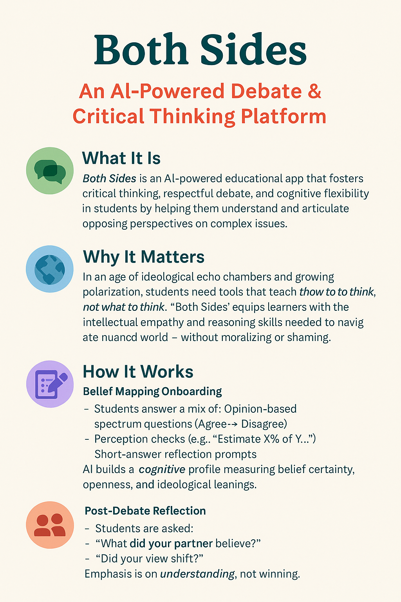

# Both Sides: AI-Powered Debate & Critical Thinking Platform

<div align="center">



**An educational platform fostering critical thinking, empathy, and ideological flexibility through AI-moderated debates**

[](https://opensource.org/licenses/MIT)
[](https://typescriptlang.org/)
[](https://nextjs.org/)
[](https://nestjs.com/)

</div>

## 🎯 Project Overview

Both Sides is an innovative educational platform that challenges students to engage with perspectives they may not agree with, fostering critical thinking and empathy through structured AI-moderated debates. Students are matched with peers holding different viewpoints and often argue for positions opposite to their own beliefs.

### Key Features

- 🧠 **AI-Powered Matching**: Sophisticated belief mapping and matching algorithms
- 💬 **Real-time Debates**: Anonymous, moderated debate sessions
- 🎯 **Perspective Switching**: Students defend viewpoints they disagree with
- 📊 **Teacher Dashboard**: Comprehensive monitoring and analytics
- 🔒 **FERPA Compliant**: Privacy-first design for educational environments
- 🏫 **School Integration**: Optional TimeBack LMS integration

## 🏗️ Architecture

### Frontend (`/both-sides-app`)
- **Framework**: Next.js 15 with TypeScript
- **Styling**: Tailwind CSS + shadcn/ui components
- **Authentication**: Clerk (planned)
- **Real-time**: Ably WebSockets (planned)

### Backend (`/both-sides-app/backend`)
- **Framework**: NestJS with TypeScript
- **Database**: PostgreSQL + Prisma ORM + pgvector
- **AI Services**: OpenAI integration
- **Caching**: Redis (Upstash for MVP)

### Infrastructure
- **MVP**: Vercel + Railway + Neon + Upstash + Ably
- **Enterprise**: AWS (Amplify/ECS + Aurora + ElastiCache + API Gateway)

## 📋 Project Structure

```
Both Sides Steel Man App/
├── 📁 both-sides-app/          # Main application code
│   ├── 📁 src/                 # Next.js frontend
│   ├── 📁 backend/             # NestJS API server
│   └── 📄 README.md            # Application setup guide
├── 📄 both_sides_prd.md        # Product Requirements Document
├── 📄 mvp_roadmap.md           # Complete MVP development roadmap
├── 📄 phase1_detailed_roadmap.md # Detailed Phase 1 implementation
└── 📄 both_sides_architecture_timeback_optional.md # Architecture docs
```

## 🚀 Quick Start

### Prerequisites
- Node.js 18+ and Yarn
- PostgreSQL database
- OpenAI API key

### Development Setup

1. **Clone the repository**
   ```bash
   git clone https://github.com/trevoralpert/both-sides-steel-man.git
   cd both-sides-steel-man/both-sides-app
   ```

2. **Install dependencies**
   ```bash
   yarn install
   cd backend && yarn install
   ```

3. **Environment setup**
   ```bash
   cp .env.example .env.local
   cd backend && cp .env.example .env
   ```
   See [`ENVIRONMENT.md`](both-sides-app/ENVIRONMENT.md) for detailed configuration.

4. **Start development servers**
   ```bash
   # Frontend (port 3000)
   yarn dev
   
   # Backend (port 3001)
   cd backend && yarn start:dev
   ```

## 📚 Documentation

| Document | Description |
|----------|-------------|
| [Product Requirements Document](both_sides_prd.md) | Complete feature specifications and requirements |
| [MVP Roadmap](mvp_roadmap.md) | 11-phase development roadmap with 300+ tasks |
| [Phase 1 Detailed Roadmap](phase1_detailed_roadmap.md) | In-depth Phase 1 implementation guide |
| [Architecture Overview](both_sides_architecture_timeback_optional.md) | System architecture and TimeBack integration |
| [Application README](both-sides-app/README.md) | Development setup and scripts |
| [Environment Setup](both-sides-app/ENVIRONMENT.md) | Configuration and deployment guide |
| [Contributing Guide](both-sides-app/CONTRIBUTING.md) | Development workflow and standards |

## 🛣️ Development Roadmap

### ✅ Phase 1: Foundation & Infrastructure
- [x] Project setup with Next.js + NestJS
- [x] Database schema design
- [x] Authentication framework
- [ ] Core user management

### 🔄 Phase 2: Core Data Models (In Progress)
- [ ] User profile system
- [ ] Class & enrollment management
- [ ] API foundation

### 📋 Upcoming Phases
- **Phase 3**: Onboarding & belief mapping
- **Phase 4**: Matching engine & debate setup
- **Phase 5**: Real-time debate system
- **Phase 6**: Debate experience & UI
- **Phase 7**: Reflection & learning analytics
- **Phase 8**: Teacher dashboard
- **Phase 9**: TimeBack integration layer
- **Phase 10**: Testing & deployment
- **Phase 11**: MVP launch

[View Complete Roadmap →](mvp_roadmap.md)

## 🎓 Educational Philosophy

Both Sides is built on the principle that critical thinking and empathy are developed through:

1. **Perspective Taking**: Students argue positions they disagree with
2. **Evidence-Based Reasoning**: AI coaching promotes factual arguments
3. **Civil Discourse**: Moderated environment ensures respectful debate
4. **Reflection**: Post-debate analysis reinforces learning
5. **Growth Mindset**: Opinion plasticity measurement encourages intellectual flexibility

## 🔐 Privacy & Compliance

- **FERPA Compliant**: Educational data privacy standards
- **Row-Level Security**: Per-organization data isolation
- **Audit Logging**: Complete activity tracking
- **Data Retention**: Configurable per-school policies
- **Encryption**: TLS in transit, at-rest encryption

## 🤝 Contributing

We welcome contributions! Please see our [Contributing Guide](both-sides-app/CONTRIBUTING.md) for development workflow, coding standards, and submission guidelines.

## 📄 License

This project is licensed under the MIT License - see the [LICENSE](LICENSE) file for details.

## 🌟 Acknowledgments

- Built with modern educational technology best practices
- Inspired by debate pedagogy and critical thinking research
- Designed for integration with existing school systems

---

<div align="center">

**[🌐 Live Demo](https://both-sides-steel-man.vercel.app)** • **[📖 Documentation](both-sides-app/README.md)** • **[🚀 Roadmap](mvp_roadmap.md)**

*Empowering students to think critically, one debate at a time.*

</div>
