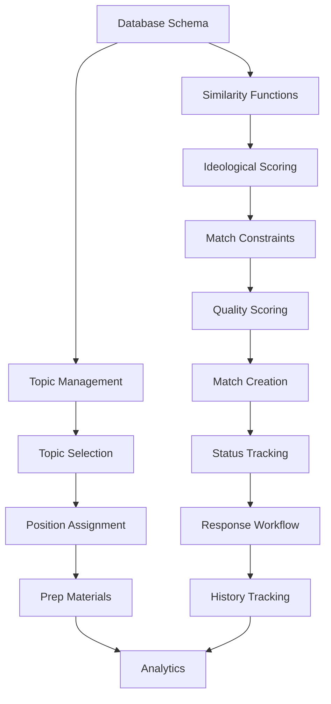

# Phase 4 Detailed Roadmap: Matching Engine & Debate Setup

## Phase Overview
**Goal**: Build the AI-powered matching system and debate initialization that pairs students with complementary belief profiles for productive debates.

**Dependencies Satisfied**: 
- ✅ Phases 1-3 Complete (100%)
- ✅ Belief profiles with AI-generated embeddings
- ✅ Ideology mapping with 7-axis framework
- ✅ Opinion plasticity scoring system
- ✅ User management and class enrollment systems

**Duration Estimate**: 3-4 weeks
**Total Tasks**: 15 across 4 major systems
**Current Progress**: 3/15 tasks complete (**20% COMPLETE**)

## 📊 **PHASE 4 STATUS SUMMARY**

### ✅ **COMPLETED: Step 4.1 - Foundation & Data Models**
- ✅ **Database Schema**: Complete matching engine database with 4 new tables
- ✅ **Vector Similarity Engine**: High-performance service with 5 API endpoints  
- ✅ **Topic Management System**: Comprehensive CRUD APIs with AI difficulty assessment
- 🚀 **Ready for**: Core matching logic development (Step 4.2)

### 🔄 **NEXT: Step 4.2 - Core Matching Logic** 
- ⏳ **Task 4.2.1**: Ideological Difference Scoring System  
- ⏳ **Task 4.2.2**: Matching Constraints & Eligibility
- ⏳ **Task 4.2.3**: Match Quality Scoring & Ranking

---

## Step 4.1: Foundation & Data Models ✅ **COMPLETE**
*Priority: Critical Foundation*
*Duration: Week 1 (5-7 days)* - **COMPLETED**

### Task 4.1.1: Database Schema Design & Implementation
**Priority**: 🔴 Critical - Must be first
**Dependencies**: Phase 2 database schemas
**Duration**: 1-2 days

**Deliverables**:
- Create `matches` table with comprehensive schema
- Create `debate_topics` table and related entities
- Create `match_history` table for tracking patterns
- Set up proper foreign key relationships and indexes
- Implement Row-Level Security policies

**Technical Specifications**:
```sql
-- matches table
- id (UUID, primary key)
- class_id (UUID, FK to classes)
- student1_id (UUID, FK to users)
- student2_id (UUID, FK to users)
- status (enum: pending, accepted, rejected, completed, cancelled)
- match_quality_score (decimal, 0-100)
- topic_id (UUID, FK to debate_topics, nullable until selection)
- student1_position (enum: pro, con)
- student2_position (enum: pro, con)
- created_at, updated_at, expires_at
- match_metadata (JSONB for algorithm details)

-- debate_topics table
- id (UUID, primary key)
- title (varchar)
- description (text)
- category (varchar)
- difficulty_level (integer, 1-10)
- complexity_score (decimal)
- pro_resources (JSONB)
- con_resources (JSONB)
- is_active (boolean)
- created_by (UUID, FK to users)
- created_at, updated_at

-- match_history table
- id (UUID, primary key)
- user_id (UUID, FK to users)
- matched_user_id (UUID, FK to users)
- match_id (UUID, FK to matches)
- outcome (enum: completed, cancelled, no_response)
- satisfaction_rating (integer, 1-5)
- created_at
```

**Success Criteria**: ✅ **ALL COMPLETE**
- [x] All tables created with proper constraints
- [x] RLS policies implemented and tested  
- [x] Migration scripts executed successfully
- [x] Database performance optimized with indexes

### Task 4.1.2: Core Embedding Similarity Functions
**Priority**: 🔴 Critical - Required for all matching
**Dependencies**: Task 4.1.1, pgvector extension from Phase 1
**Duration**: 1-2 days

**Deliverables**:
- Vector similarity calculation service
- Embedding comparison utilities
- Performance-optimized similarity queries
- Similarity threshold configuration system

**Technical Specifications**:
```typescript
// Vector similarity service
class VectorSimilarityService {
  calculateCosineSimilarity(vector1: number[], vector2: number[]): number
  calculateEuclideanDistance(vector1: number[], vector2: number[]): number
  findSimilarProfiles(targetVector: number[], limit: number, threshold: number): Profile[]
  batchSimilarityCalculation(targetId: string, candidateIds: string[]): SimilarityScore[]
}

// SQL optimization for vector searches
CREATE INDEX ON profiles USING ivfflat (belief_embedding vector_cosine_ops)
```

**Success Criteria**: ✅ **ALL COMPLETE**
- [x] Similarity calculations return consistent results
- [x] Vector searches complete in <500ms for 1000+ profiles
- [x] Batch processing handles 50+ comparisons efficiently
- [x] Similarity scores are properly normalized (0-1 scale)

### Task 4.1.3: Basic Topic Management System
**Priority**: 🟡 Medium - Can be developed in parallel
**Dependencies**: Task 4.1.1
**Duration**: 2-3 days

**Deliverables**:
- Topic CRUD API endpoints
- Topic categorization system
- Basic topic search and filtering
- Topic difficulty assessment framework

**Technical Specifications**:
```typescript
// Topic management service
class TopicManagementService {
  createTopic(data: CreateTopicDto): Promise<DebateTopic>
  updateTopic(id: string, data: UpdateTopicDto): Promise<DebateTopic>
  deleteTopic(id: string): Promise<void>
  searchTopics(filters: TopicSearchDto): Promise<DebateTopic[]>
  getTopicsByCategory(category: string): Promise<DebateTopic[]>
  assessTopicDifficulty(topicId: string): Promise<number>
}
```

**API Endpoints**:
- `POST /api/topics` - Create topic
- `GET /api/topics` - List/search topics
- `GET /api/topics/:id` - Get topic details
- `PUT /api/topics/:id` - Update topic
- `DELETE /api/topics/:id` - Delete topic
- `GET /api/topics/categories` - Get categories

**Success Criteria**: ✅ **ALL COMPLETE**
- [x] CRUD operations work reliably
- [x] Topic search returns relevant results  
- [x] Difficulty scoring is consistent and meaningful
- [x] API endpoints properly validated and secured

---

## Step 4.2: Core Matching Logic 🧠
*Priority: Critical Path*
*Duration: Week 2 (5-7 days)*

### Task 4.2.1: Ideological Difference Scoring System
**Priority**: 🔴 Critical - Core matching algorithm
**Dependencies**: Tasks 4.1.1, 4.1.2, Phase 3 belief mapping
**Duration**: 2-3 days

**Deliverables**:
- Multi-axis ideological difference calculator
- Weighted scoring system for 7 ideology axes
- Difference threshold configuration
- Complementarity vs similarity balance logic

**Technical Specifications**:
```typescript
interface IdeologyScores {
  liberal_conservative: number;
  authoritarian_libertarian: number;
  globalist_nationalist: number;
  progressive_traditional: number;
  collective_individualist: number;
  secular_religious: number;
  interventionist_isolationist: number;
}

class IdeologicalDifferenceService {
  calculateAxisDifferences(profile1: IdeologyScores, profile2: IdeologyScores): AxisDifferences
  calculateOverallDifference(differences: AxisDifferences): number
  determineComplementarity(profile1: BeliefProfile, profile2: BeliefProfile): ComplementarityScore
  applyPlasticityWeighting(baseScore: number, plasticity1: number, plasticity2: number): number
}
```

**Algorithm Logic**:
1. Calculate absolute differences on each axis (0-100 scale)
2. Apply axis-specific weights based on educational value
3. Factor in opinion plasticity scores
4. Balance similarity (for common ground) vs difference (for learning)
5. Output final complementarity score (0-100)

**Success Criteria**:
- [ ] Difference calculations are mathematically sound
- [ ] Scoring produces meaningful educational pairings
- [ ] Plasticity weighting improves match outcomes
- [ ] Algorithm handles edge cases gracefully

### Task 4.2.2: Matching Constraints & Eligibility
**Priority**: 🔴 Critical - Prevents invalid matches
**Dependencies**: Task 4.2.1, Phase 2 class management
**Duration**: 2-3 days

**Deliverables**:
- Class-based matching restrictions
- Availability and scheduling constraints
- Previous match history filtering
- User preference and block systems

**Technical Specifications**:
```typescript
interface MatchingConstraints {
  sameClass: boolean;
  availabilityOverlap: boolean;
  noPreviousMatch: boolean;
  respectUserBlocks: boolean;
  minimumProfileCompleteness: number;
  maximumMatchFrequency: number;
}

class MatchingConstraintsService {
  checkClassEligibility(user1: User, user2: User): boolean
  checkAvailability(user1: User, user2: User, timeWindow: TimeWindow): boolean
  checkMatchHistory(user1Id: string, user2Id: string, cooldownDays: number): boolean
  checkUserBlocks(user1Id: string, user2Id: string): boolean
  validateProfileCompleteness(profile: BeliefProfile, threshold: number): boolean
}
```

**Constraint Rules**:
- Must be in same class/organization
- No matches between same users within 14 days
- Both profiles must be >80% complete
- Respect user blocking/preference lists
- Consider user availability windows
- Limit matches per user per week (max 3)

**Success Criteria**:
- [ ] Constraints prevent inappropriate matches
- [ ] Rules are configurable per class/organization
- [ ] Performance impact is minimal (<100ms per check)
- [ ] Edge cases handled with clear error messages

### Task 4.2.3: Match Quality Scoring & Ranking
**Priority**: 🔴 Critical - Determines match success
**Dependencies**: Tasks 4.2.1, 4.2.2
**Duration**: 2-3 days

**Deliverables**:
- Comprehensive match quality algorithm
- Multi-factor scoring system
- Match ranking and prioritization
- Quality prediction and validation

**Technical Specifications**:
```typescript
interface MatchQualityFactors {
  ideologicalComplementarity: number; // 0-100
  plasticityAlignment: number; // 0-100
  experienceBalance: number; // 0-100
  personalityCompatibility: number; // 0-100
  topicRelevance: number; // 0-100
  historicalPerformance: number; // 0-100
}

class MatchQualityService {
  calculateQualityScore(user1: User, user2: User, topic: DebateTopic): MatchQualityFactors
  rankPotentialMatches(userId: string, candidates: User[], topic: DebateTopic): RankedMatch[]
  predictMatchSuccess(qualityScore: MatchQualityFactors): PredictionResult
  validateQualityScoring(matchResults: CompletedMatch[]): ValidationReport
}
```

**Quality Formula**:
- Ideological Complementarity: 35% weight
- Plasticity Alignment: 20% weight
- Experience Balance: 15% weight
- Personality Compatibility: 15% weight
- Topic Relevance: 10% weight
- Historical Performance: 5% weight

**Success Criteria**:
- [ ] Quality scores correlate with successful debates
- [ ] Ranking algorithm selects optimal pairings
- [ ] Prediction accuracy >75% for match success
- [ ] Scoring system is interpretable and debuggable

---

## Step 4.3: Match Management System 🔄
*Priority: Core Functionality*
*Duration: Week 2-3 (5-7 days)*

### Task 4.3.1: Match Creation & Assignment APIs
**Priority**: 🔴 Critical - Core system functionality
**Dependencies**: Tasks 4.2.1, 4.2.2, 4.2.3
**Duration**: 2-3 days

**Deliverables**:
- Match creation service and APIs
- Automated matching algorithm
- Manual match creation for teachers
- Match assignment notification system

**Technical Specifications**:
```typescript
class MatchCreationService {
  createAutomaticMatch(classId: string, parameters: MatchingParameters): Promise<Match>
  createManualMatch(teacherId: string, student1Id: string, student2Id: string, topicId: string): Promise<Match>
  findOptimalMatches(classId: string, count: number): Promise<OptimalMatchSet>
  sendMatchNotifications(match: Match): Promise<void>
}
```

**API Endpoints**:
- `POST /api/matches/auto` - Create automatic matches
- `POST /api/matches/manual` - Create manual match
- `GET /api/matches/suggestions/:classId` - Get suggested matches
- `POST /api/matches/:id/assign-positions` - Assign debate positions
- `GET /api/matches/user/:userId` - Get user's matches

**Success Criteria**:
- [ ] Automatic matching creates high-quality pairs
- [ ] Manual creation works with proper validation
- [ ] Position assignment is fair and educational
- [ ] Notifications are sent reliably

### Task 4.3.2: Match Status Tracking & Lifecycle
**Priority**: 🔴 Critical - Essential for user experience
**Dependencies**: Task 4.3.1
**Duration**: 2-3 days

**Deliverables**:
- Match state management system
- Status transition validation
- Lifecycle event tracking
- Automated status updates

**Technical Specifications**:
```typescript
enum MatchStatus {
  PENDING = 'pending',
  ACCEPTED = 'accepted',
  REJECTED = 'rejected',
  IN_PROGRESS = 'in_progress',
  COMPLETED = 'completed',
  CANCELLED = 'cancelled',
  EXPIRED = 'expired'
}

class MatchStatusService {
  updateMatchStatus(matchId: string, status: MatchStatus, userId: string): Promise<Match>
  validateStatusTransition(currentStatus: MatchStatus, newStatus: MatchStatus): boolean
  handleStatusChange(match: Match, previousStatus: MatchStatus): Promise<void>
  scheduleStatusChecks(match: Match): Promise<void>
  getMatchTimeline(matchId: string): Promise<StatusEvent[]>
}
```

**Status Flow**:
1. PENDING → ACCEPTED (both users accept)
2. PENDING → REJECTED (either user rejects)
3. PENDING → EXPIRED (no response within timeframe)
4. ACCEPTED → IN_PROGRESS (debate starts)
5. IN_PROGRESS → COMPLETED (debate finishes)
6. Any status → CANCELLED (by teacher/admin)

**Success Criteria**:
- [ ] Status transitions follow business rules
- [ ] Events are logged for audit trail
- [ ] Automated transitions work reliably
- [ ] Users receive appropriate notifications

### Task 4.3.3: Match Acceptance/Rejection Workflow
**Priority**: 🔴 Critical - User agency essential
**Dependencies**: Task 4.3.2
**Duration**: 1-2 days

**Deliverables**:
- User acceptance/rejection interface
- Response time tracking
- Automatic match expiration
- Rejection reason collection

**Technical Specifications**:
```typescript
interface MatchResponse {
  matchId: string;
  userId: string;
  response: 'accept' | 'reject';
  reason?: string;
  respondedAt: Date;
}

class MatchResponseService {
  recordUserResponse(response: MatchResponse): Promise<void>
  checkBothResponses(matchId: string): Promise<MatchDecision>
  handleMatchRejection(matchId: string, reason: string): Promise<void>
  scheduleMatchExpiration(matchId: string, hoursToExpire: number): Promise<void>
  collectRejectionFeedback(userId: string, reason: string): Promise<void>
}
```

**Workflow Logic**:
1. Match created → Both users notified
2. Users have 24 hours to respond
3. Both accept → Status changes to ACCEPTED
4. Either rejects → Status changes to REJECTED
5. No response → Status changes to EXPIRED after 24h
6. Collect optional rejection reasons for algorithm improvement

**Success Criteria**:
- [ ] Response workflow is intuitive and clear
- [ ] Timeouts work correctly without requiring manual intervention
- [ ] Rejection data improves future matching
- [ ] Users understand consequences of their choices

---

## Step 4.4: Advanced Features & Topic System 🎯
*Priority: Enhancement Features*
*Duration: Week 3-4 (5-7 days)*

### Task 4.4.1: Match History & Cooldown Logic
**Priority**: 🟡 Medium - Improves user experience
**Dependencies**: Task 4.3.3
**Duration**: 1-2 days

**Deliverables**:
- Match history tracking system
- User cooldown enforcement
- Repeat match prevention
- Historical performance analysis

**Technical Specifications**:
```typescript
class MatchHistoryService {
  recordMatchCompletion(matchId: string, outcome: MatchOutcome): Promise<void>
  checkUserCooldown(userId: string, potentialMatchId: string): Promise<boolean>
  getMatchHistory(userId: string, limit?: number): Promise<MatchHistoryEntry[]>
  calculateUserMatchingStats(userId: string): Promise<MatchingStats>
  preventRecentRematches(user1Id: string, user2Id: string, daysCooldown: number): Promise<boolean>
}

interface MatchingStats {
  totalMatches: number;
  completedMatches: number;
  averageQualityScore: number;
  preferredTopics: string[];
  improvementTrend: number;
}
```

**Cooldown Rules**:
- Same user pairs: 14 day cooldown
- User daily limit: Maximum 1 new match per day
- Weekly limit: Maximum 3 matches per week
- Quality-based cooldown: Poor matches trigger longer cooldowns

**Success Criteria**:
- [ ] History tracking is comprehensive and accurate
- [ ] Cooldowns prevent matching fatigue
- [ ] Statistics provide meaningful insights
- [ ] Performance remains optimal with large datasets

### Task 4.4.2: Topic Selection Algorithm
**Priority**: 🟡 Medium - Enhances match quality
**Dependencies**: Tasks 4.1.3, 4.2.3
**Duration**: 2-3 days

**Deliverables**:
- Intelligent topic selection algorithm
- Topic-user compatibility scoring
- Difficulty progression system
- Topic rotation and freshness management

**Technical Specifications**:
```typescript
class TopicSelectionService {
  selectOptimalTopic(user1: User, user2: User, availableTopics: DebateTopic[]): Promise<DebateTopic>
  scoreTopicCompatibility(user: User, topic: DebateTopic): Promise<number>
  recommendDifficultyProgression(userId: string): Promise<number>
  ensureTopicFreshness(userId: string, recentTopics: string[]): Promise<DebateTopic[]>
  balanceTopicCategories(classId: string): Promise<TopicDistribution>
}

interface TopicCompatibilityFactors {
  beliefRelevance: number; // How relevant to user's beliefs
  difficultyMatch: number; // Appropriate difficulty level
  interestAlignment: number; // User's topic interests
  experienceLevel: number; // User's debate experience
  categoryBalance: number; // Ensuring variety
}
```

**Selection Algorithm**:
1. Filter topics by user experience/difficulty level
2. Score each topic for both users individually
3. Find topics that optimize both users' engagement
4. Apply freshness filters to avoid repetition
5. Ensure category balance across class

**Success Criteria**:
- [ ] Selected topics engage both users effectively
- [ ] Difficulty progression is appropriate
- [ ] Topic distribution is balanced across categories
- [ ] Algorithm adapts to user feedback over time

### Task 4.4.3: Position Assignment System
**Priority**: 🔴 Critical - Core debate mechanic
**Dependencies**: Task 4.4.2
**Duration**: 1-2 days

**Deliverables**:
- Fair position assignment algorithm
- Educational value optimization
- Position preference consideration
- Challenge level balancing

**Technical Specifications**:
```typescript
interface PositionAssignment {
  user1Position: 'pro' | 'con';
  user2Position: 'pro' | 'con';
  assignmentReason: string;
  challengeLevel: number;
  educationalValue: number;
}

class PositionAssignmentService {
  assignPositions(user1: User, user2: User, topic: DebateTopic): Promise<PositionAssignment>
  calculatePositionChallenge(user: User, position: 'pro' | 'con', topic: DebateTopic): number
  balanceEducationalValue(assignment: PositionAssignment): number
  respectUserPreferences(userId: string, preferences: PositionPreferences): boolean
  ensureVariety(userId: string, recentPositions: string[]): 'pro' | 'con'
}
```

**Assignment Logic**:
1. Analyze each user's beliefs relative to topic
2. Calculate challenge level for each position
3. Optimize for educational growth (challenging but fair)
4. Respect user preferences when reasonable
5. Ensure position variety over time
6. Balance difficulty between both users

**Success Criteria**:
- [ ] Assignments create meaningful educational challenges
- [ ] Both users have fair but engaging positions
- [ ] Position variety is maintained over time
- [ ] Algorithm explains assignment reasoning clearly

### Task 4.4.4: Debate Preparation Materials System
**Priority**: 🟡 Medium - Educational enhancement
**Dependencies**: Task 4.4.3
**Duration**: 2-3 days

**Deliverables**:
- Position-specific resource generation
- AI-powered argument suggestions
- Evidence and source recommendations
- Preparation timeline guidance

**Technical Specifications**:
```typescript
interface PreparationMaterials {
  positionOverview: string;
  keyArguments: Argument[];
  evidenceSources: Source[];
  counterArgumentPrep: CounterArg[];
  preparationTips: string[];
  timelineGuidance: PrepTimeline;
}

class PreparationMaterialsService {
  generateMaterials(user: User, position: 'pro' | 'con', topic: DebateTopic): Promise<PreparationMaterials>
  suggestKeyArguments(position: 'pro' | 'con', topic: DebateTopic): Promise<Argument[]>
  recommendEvidenceSources(topic: DebateTopic, position: 'pro' | 'con'): Promise<Source[]>
  createPreparationTimeline(match: Match): Promise<PrepTimeline>
  adaptToUserLevel(materials: PreparationMaterials, userLevel: number): PreparationMaterials
}
```

**Material Types**:
- Position overview and key themes
- 3-5 strongest arguments for position
- Evidence sources and statistics
- Anticipated counterarguments
- Logical reasoning frameworks
- Preparation timeline with milestones

**Success Criteria**:
- [ ] Materials are relevant and high-quality
- [ ] Content is appropriate for user experience level
- [ ] Sources are credible and current
- [ ] Preparation guidance improves debate quality

### Task 4.4.5: Match Analytics & Success Metrics
**Priority**: 🟡 Medium - System improvement
**Dependencies**: All previous tasks
**Duration**: 2-3 days

**Deliverables**:
- Match outcome tracking system
- Quality prediction validation
- Algorithm performance metrics
- Continuous improvement feedback loop

**Technical Specifications**:
```typescript
interface MatchAnalytics {
  matchQualityPrediction: number;
  actualOutcome: MatchOutcome;
  userSatisfactionRatings: SatisfactionRating[];
  debateQualityMetrics: DebateMetrics;
  learningOutcomes: LearningOutcome[];
  algorithmPerformance: AlgorithmMetrics;
}

class MatchAnalyticsService {
  trackMatchOutcome(match: Match, outcome: MatchOutcome): Promise<void>
  validateQualityPredictions(matches: Match[]): Promise<ValidationReport>
  calculateAlgorithmAccuracy(period: DateRange): Promise<AccuracyReport>
  identifyImprovementOpportunities(analytics: MatchAnalytics[]): Promise<ImprovementSuggestion[]>
  generateMatchingInsights(classId: string): Promise<ClassInsights>
}
```

**Metrics Tracked**:
- Match quality prediction vs actual satisfaction
- Debate completion rates
- User engagement levels
- Learning outcome achievements
- Algorithm decision accuracy
- System performance benchmarks

**Success Criteria**:
- [ ] Analytics provide actionable insights
- [ ] Quality predictions improve over time
- [ ] System performance is measured and optimized
- [ ] Feedback loop drives algorithm improvements

---

## Integration Points & Dependencies

### External Dependencies
- **Phase 3 Belief Profiles**: Required for all matching logic
- **OpenAI API**: For topic analysis and material generation
- **pgvector**: For similarity calculations
- **Redis Cache**: For performance optimization
- **Notification System**: For user communications

### Internal Service Dependencies


### API Integration Points
- `POST /api/matches` - Create new matches
- `GET /api/matches/suggestions` - Get match suggestions
- `PUT /api/matches/:id/respond` - Accept/reject matches
- `GET /api/topics/recommended` - Get recommended topics
- `GET /api/users/:id/matching-stats` - User matching statistics

---

## Testing Strategy

### Unit Testing
- [ ] Vector similarity calculations
- [ ] Ideological difference scoring
- [ ] Match constraint validation
- [ ] Quality scoring algorithms
- [ ] Status transition logic

### Integration Testing
- [ ] End-to-end matching workflows
- [ ] Database operations and performance
- [ ] API endpoint functionality
- [ ] Notification system integration
- [ ] Cache layer effectiveness

### Performance Testing
- [ ] Similarity calculations at scale (1000+ users)
- [ ] Match creation response times (<2s)
- [ ] Database query optimization
- [ ] Concurrent user handling
- [ ] Memory usage under load

---

## Success Metrics

### Technical Metrics
- Match creation time: <2 seconds for 95% of requests
- Similarity calculation accuracy: >95% consistent results
- API response times: <500ms for 95th percentile
- Database query performance: <100ms for complex matches
- System uptime: >99.5%

### Product Metrics
- Match acceptance rate: >70%
- Debate completion rate: >80% of accepted matches
- User satisfaction: >4.0/5.0 average rating
- Match quality correlation: >75% accuracy in predictions
- Repeat usage: >50% of users accept multiple matches

### Educational Metrics
- Learning outcome achievement: Measured post-debate
- Opinion plasticity engagement: Tracked over time
- Critical thinking skill development: Assessed quarterly
- Cross-ideological understanding: Pre/post surveys

---

## Risk Mitigation

### Technical Risks
- **Vector calculation performance**: Implement caching and batch processing
- **Database scalability**: Use proper indexing and query optimization
- **Algorithm complexity**: Start simple, iterate based on results
- **Real-time requirements**: Use Redis for fast lookups

### Product Risks
- **Low match acceptance**: A/B test invitation strategies
- **Poor match quality**: Continuous algorithm refinement
- **User engagement**: Gamification and progress tracking
- **Teacher adoption**: Comprehensive admin tools

### Timeline Risks
- **Dependency bottlenecks**: Parallel development where possible
- **Scope creep**: Strict task definition and success criteria
- **Integration challenges**: Early prototype testing
- **Performance issues**: Load testing throughout development

---

## Deployment Plan

### Phase 4.1 (Foundation) - Week 1
- Deploy database schema changes
- Release similarity calculation APIs
- Basic topic management functionality
- Internal testing and validation

### Phase 4.2 (Core Logic) - Week 2  
- Deploy matching algorithm services
- Release constraint and quality scoring
- Internal testing with synthetic data
- Performance benchmarking

### Phase 4.3 (Management) - Week 2-3
- Deploy match creation and status APIs
- Release user response workflows
- Teacher admin interface updates
- User acceptance testing

### Phase 4.4 (Advanced) - Week 3-4
- Deploy topic selection and position assignment
- Release preparation materials system
- Analytics and reporting features
- Full end-to-end testing

---

## Next Phase Preparation

### Phase 5 Readiness Checklist
- [ ] Matches can be created and accepted reliably
- [ ] Topic selection and position assignment work
- [ ] Match status tracking is comprehensive
- [ ] Analytics provide baseline metrics
- [ ] Performance benchmarks meet requirements
- [ ] Teacher admin tools are functional
- [ ] User experience flows are validated

### Data Requirements for Phase 5
- Match completion data for real-time system testing
- User preference patterns for personalization
- Topic performance data for content optimization
- Quality prediction accuracy for algorithm refinement

This roadmap ensures optimal development flow while maintaining flexibility for iteration and improvement based on testing results and user feedback.
