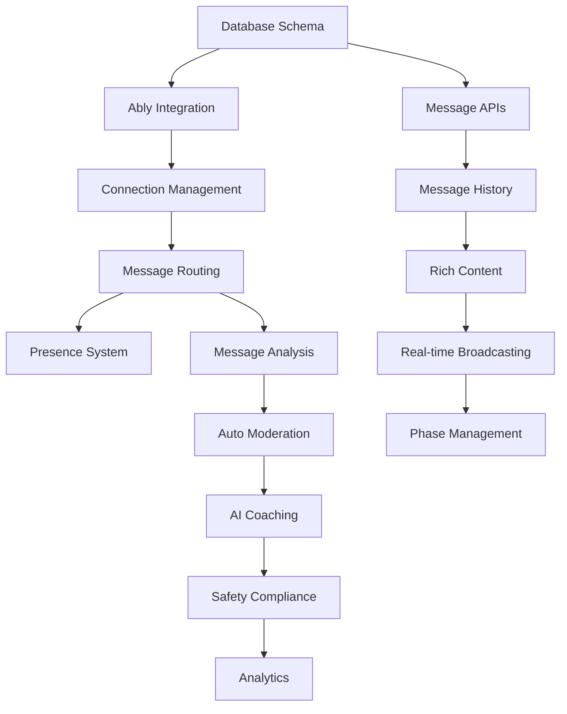

# Phase 5 Detailed Roadmap: Real-time Debate System

## Phase Overview
**Goal**: Build the core real-time debate experience with messaging, AI moderation, and interactive debate management that transforms accepted matches into productive, moderated debates.

**Dependencies Satisfied**: 
- ✅ Phase 4 Complete (100%) - Matching engine fully operational
- ✅ Match creation and acceptance workflows functional
- ✅ Topic selection and position assignment working
- ✅ User profiles with belief embeddings available
- ✅ Debate preparation materials system ready

**Duration Estimate**: 3-4 weeks
**Total Tasks**: 15 across 3 major systems
**Current Progress**: 0/15 tasks complete (**0% COMPLETE**)

## 📊 **PHASE 5 STATUS SUMMARY**

### 🔄 **NEXT: Step 5.1 - Real-time Infrastructure Foundation**
- ⏳ **Database Schema**: Conversations, messages, and debate session tables
- ⏳ **Ably Integration**: Real-time messaging service setup and configuration
- ⏳ **WebSocket Management**: Connection lifecycle and state management
- ⏳ **Message Routing**: Real-time message delivery and presence system

### 🔄 **FOLLOWING: Step 5.2 - Core Messaging System** 
- ⏳ **Message APIs**: CRUD operations and history management
- ⏳ **Real-time Delivery**: Live message broadcasting and status tracking
- ⏳ **Rich Content**: Text formatting, emoji, and media support
- ⏳ **Conversation Management**: Thread organization and debate structure

### 🔄 **FINAL: Step 5.3 - AI Moderation & Enhancement** 
- ⏳ **Moderation Pipeline**: Real-time content analysis and filtering
- ⏳ **AI Coaching**: Contextual suggestions and debate guidance
- ⏳ **Analytics**: Performance tracking and improvement insights
- ⏳ **Safety Systems**: Comprehensive content and behavior monitoring

---

## Step 5.1: Real-time Infrastructure Foundation 🏗️
*Priority: Critical Foundation*
*Duration: Week 1 (5-7 days)*

### Task 5.1.1: Database Schema for Conversations & Messages
**Priority**: 🔴 Critical - Must be first
**Dependencies**: Phase 4 database schema, existing match system
**Duration**: 1-2 days

**Deliverables**:
- Create `conversations` table linking to matches
- Create `messages` table with rich content support
- Create `debate_sessions` table for session management
- Set up proper foreign key relationships and indexes
- Implement Row-Level Security policies

**Technical Specifications**:
```sql
-- conversations table
- id (UUID, primary key)
- match_id (UUID, FK to matches, unique)
- status (enum: preparing, active, paused, completed, cancelled)
- debate_phase (enum: opening, discussion, rebuttal, closing)
- phase_deadline (timestamp)
- started_at (timestamp, nullable)
- ended_at (timestamp, nullable)
- conversation_metadata (JSONB for session config)
- created_at, updated_at

-- messages table
- id (UUID, primary key)
- conversation_id (UUID, FK to conversations)
- user_id (UUID, FK to users)
- content (text)
- content_type (enum: text, system, moderation, coaching)
- message_metadata (JSONB for formatting, attachments)
- reply_to_id (UUID, FK to messages, nullable)
- status (enum: sent, delivered, read, moderated, deleted)
- moderation_status (enum: approved, flagged, blocked, reviewed)
- created_at, updated_at, edited_at

-- debate_sessions table
- id (UUID, primary key)
- conversation_id (UUID, FK to conversations)
- session_config (JSONB)
- participant_states (JSONB)
- phase_history (JSONB)
- performance_metrics (JSONB)
- created_at, updated_at
```

**Success Criteria**:
- [ ] All tables created with proper constraints and relationships
- [ ] RLS policies protect conversation access by participants
- [ ] Indexes optimized for real-time queries (<50ms)
- [ ] Schema supports debate phases and moderation workflows

### Task 5.1.2: Ably Real-time Service Integration
**Priority**: 🔴 Critical - Core messaging infrastructure
**Dependencies**: Task 5.1.1, Ably account setup
**Duration**: 1-2 days

**Deliverables**:
- Ably service configuration and API key management
- Channel naming conventions and organization
- Authentication integration with existing JWT system
- Rate limiting and connection quotas configuration

**Technical Specifications**:
```typescript
// Ably configuration service
class AblyConfigService {
  initializeClient(userId: string, capabilities: string[]): AblyRealtime
  generateTokenRequest(userId: string, conversationId: string): TokenRequest
  createConversationChannel(conversationId: string): Channel
  setupChannelPresence(channel: Channel, userId: string): Promise<void>
}

// Channel naming strategy
channels: {
  conversation: `conversation:${conversationId}`,
  presence: `presence:${conversationId}`,
  moderation: `moderation:${conversationId}`,
  coaching: `coaching:${userId}:${conversationId}`
}
```

**Success Criteria**:
- [ ] Ably client connects reliably with JWT authentication
- [ ] Channel permissions properly restrict access to participants
- [ ] Connection state management handles network interruptions
- [ ] Rate limiting prevents abuse while allowing natural conversation

### Task 5.1.3: WebSocket Connection Management
**Priority**: 🔴 Critical - Foundation for all real-time features
**Dependencies**: Task 5.1.2
**Duration**: 2 days

**Deliverables**:
- Connection lifecycle management service
- Automatic reconnection with exponential backoff
- Connection state synchronization
- Error handling and fallback mechanisms

**Technical Specifications**:
```typescript
interface ConnectionState {
  status: 'connecting' | 'connected' | 'disconnected' | 'failed';
  lastConnected: Date;
  reconnectAttempts: number;
  latency: number;
  conversationId: string;
  userId: string;
}

class ConnectionManagerService {
  connect(conversationId: string, userId: string): Promise<Connection>
  disconnect(conversationId: string): void
  handleReconnection(connection: Connection): Promise<void>
  syncState(connection: Connection): Promise<void>
  monitorConnection(connection: Connection): void
}
```

**Connection Resilience Strategy**:
- Automatic reconnection with 1s, 2s, 4s, 8s, 16s, 30s intervals
- Connection quality monitoring (latency, packet loss)
- Graceful degradation to HTTP polling if WebSocket fails
- State synchronization on reconnection

**Success Criteria**:
- [ ] Connections establish within 2 seconds in 95% of cases
- [ ] Automatic reconnection works reliably on network changes
- [ ] Connection state remains synchronized across devices
- [ ] Graceful handling of connection failures and timeouts

### Task 5.1.4: Message Routing & Delivery System
**Priority**: 🔴 Critical - Core messaging functionality
**Dependencies**: Task 5.1.3
**Duration**: 2 days

**Deliverables**:
- Real-time message broadcasting service
- Message delivery confirmation system
- Message queuing for offline participants
- Duplicate detection and ordering

**Technical Specifications**:
```typescript
interface MessageDelivery {
  messageId: string;
  conversationId: string;
  senderId: string;
  recipients: string[];
  deliveryStatus: Map<string, 'pending' | 'delivered' | 'read'>;
  timestamp: Date;
  retryCount: number;
}

class MessageRoutingService {
  broadcastMessage(message: Message, conversationId: string): Promise<MessageDelivery>
  queueOfflineMessage(message: Message, userId: string): Promise<void>
  confirmDelivery(messageId: string, userId: string): Promise<void>
  markAsRead(messageId: string, userId: string): Promise<void>
  getUndeliveredMessages(userId: string, conversationId: string): Promise<Message[]>
}
```

**Routing Rules**:
- Messages broadcast to all conversation participants
- System messages (phase changes, moderation) to all participants
- Coaching messages only to intended recipient
- Offline message queuing with 24-hour retention

**Success Criteria**:
- [ ] Messages delivered in <500ms to active participants
- [ ] Delivery confirmations tracked accurately
- [ ] Offline messages queued and delivered on reconnection
- [ ] Message ordering preserved during network issues

### Task 5.1.5: Real-time Presence & Typing Indicators
**Priority**: 🟡 Medium - Enhanced user experience
**Dependencies**: Task 5.1.4
**Duration**: 1-2 days

**Deliverables**:
- User presence tracking (online, away, typing)
- Typing indicator system with timeout
- Last seen timestamps
- Connection quality indicators

**Technical Specifications**:
```typescript
interface PresenceState {
  userId: string;
  status: 'online' | 'away' | 'offline';
  isTyping: boolean;
  lastSeen: Date;
  connectionQuality: 'excellent' | 'good' | 'poor';
  deviceInfo: {
    type: 'desktop' | 'mobile' | 'tablet';
    browser?: string;
  };
}

class PresenceService {
  updatePresence(userId: string, state: Partial<PresenceState>): void
  startTyping(userId: string, conversationId: string): void
  stopTyping(userId: string, conversationId: string): void
  getPresenceState(conversationId: string): Promise<PresenceState[]>
  subscribeToPresence(conversationId: string, callback: (states: PresenceState[]) => void): void
}
```

**Presence Logic**:
- Typing indicators timeout after 3 seconds of inactivity
- Away status after 5 minutes of no activity
- Offline status after connection loss or browser close
- Connection quality based on latency and reliability

**Success Criteria**:
- [ ] Presence state updates reflect within 1 second
- [ ] Typing indicators appear and disappear correctly
- [ ] Last seen timestamps are accurate
- [ ] Connection quality provides meaningful feedback

---

## Step 5.2: Core Messaging System 💬
*Priority: Core Functionality*
*Duration: Week 2 (5-7 days)*

### Task 5.2.1: Message Creation & Storage APIs
**Priority**: 🔴 Critical - Core messaging functionality
**Dependencies**: Task 5.1.1, all of Step 5.1
**Duration**: 2 days

**Deliverables**:
- Message creation and validation APIs
- Message storage with metadata support
- Message editing and deletion workflows
- Thread/reply management system

**Technical Specifications**:
```typescript
interface CreateMessageRequest {
  conversationId: string;
  content: string;
  contentType: 'text' | 'system' | 'moderation' | 'coaching';
  replyToId?: string;
  metadata?: {
    formatting?: FormattingOptions;
    attachments?: Attachment[];
    debatePhase?: string;
  };
}

class MessageService {
  createMessage(userId: string, request: CreateMessageRequest): Promise<Message>
  editMessage(messageId: string, userId: string, content: string): Promise<Message>
  deleteMessage(messageId: string, userId: string): Promise<void>
  getMessageThread(messageId: string): Promise<Message[]>
  validateMessageContent(content: string, contentType: string): ValidationResult
}
```

**API Endpoints**:
- `POST /api/conversations/:id/messages` - Create message
- `PUT /api/messages/:id` - Edit message (within 5 minutes)
- `DELETE /api/messages/:id` - Delete message (soft delete)
- `GET /api/messages/:id/thread` - Get message thread/replies
- `POST /api/messages/:id/react` - Add emoji reaction

**Success Criteria**:
- [ ] Messages created and stored reliably with <200ms response time
- [ ] Content validation prevents malicious or invalid content
- [ ] Message editing works within time limits
- [ ] Thread/reply structure maintains conversation flow

### Task 5.2.2: Message History & Pagination
**Priority**: 🔴 Critical - Essential for debate continuity
**Dependencies**: Task 5.2.1
**Duration**: 1-2 days

**Deliverables**:
- Efficient message history retrieval
- Cursor-based pagination for performance
- Message search and filtering
- Export functionality for completed debates

**Technical Specifications**:
```typescript
interface MessageHistoryRequest {
  conversationId: string;
  limit: number;
  cursor?: string;
  filters?: {
    fromUser?: string;
    messageType?: string[];
    dateRange?: [Date, Date];
    searchTerm?: string;
  };
}

class MessageHistoryService {
  getMessageHistory(request: MessageHistoryRequest): Promise<PaginatedMessages>
  searchMessages(conversationId: string, query: string): Promise<Message[]>
  exportConversation(conversationId: string, format: 'json' | 'txt' | 'pdf'): Promise<ExportResult>
  getMessageContext(messageId: string, contextSize: number): Promise<Message[]>
}
```

**Performance Optimizations**:
- Cursor-based pagination for efficient scrolling
- Database indexes on conversation_id, created_at
- Message caching for recent conversations
- Lazy loading of message metadata and attachments

**Success Criteria**:
- [ ] Message history loads in <500ms for 50 messages
- [ ] Pagination works smoothly without duplicates
- [ ] Search returns relevant results in <1 second
- [ ] Export generates complete conversation records

### Task 5.2.3: Rich Text & Content Formatting
**Priority**: 🟡 Medium - Enhanced user experience
**Dependencies**: Task 5.2.2
**Duration**: 2 days

**Deliverables**:
- Rich text editor integration
- Markdown support for formatting
- Link preview and metadata extraction
- Image and file attachment handling

**Technical Specifications**:
```typescript
interface FormattingOptions {
  bold: boolean;
  italic: boolean;
  underline: boolean;
  strikethrough: boolean;
  code: boolean;
  codeBlock: boolean;
  quote: boolean;
  list: 'none' | 'bulleted' | 'numbered';
}

interface Attachment {
  id: string;
  type: 'image' | 'file' | 'link';
  url: string;
  filename?: string;
  size?: number;
  metadata?: {
    width?: number;
    height?: number;
    duration?: number;
    title?: string;
    description?: string;
  };
}

class ContentFormattingService {
  parseMarkdown(content: string): FormattedContent
  extractLinks(content: string): Promise<LinkPreview[]>
  validateAttachment(file: File): ValidationResult
  generateLinkPreview(url: string): Promise<LinkPreview>
  sanitizeContent(content: string): string
}
```

**Supported Formatting**:
- Basic markdown: **bold**, *italic*, `code`, ```code blocks```
- Quote blocks and lists
- @mentions of debate participants
- Link previews with title, description, image
- Image attachments with preview
- File attachments with type validation

**Success Criteria**:
- [ ] Rich text editor provides intuitive formatting options
- [ ] Markdown renders correctly and consistently
- [ ] Link previews load without slowing message sending
- [ ] Attachments upload and display properly

### Task 5.2.4: Real-time Message Broadcasting
**Priority**: 🔴 Critical - Core real-time functionality
**Dependencies**: Task 5.2.3, Task 5.1.4
**Duration**: 2 days

**Deliverables**:
- Real-time message delivery to all participants
- Message status updates (sent/delivered/read)
- Optimistic UI updates with rollback
- Message synchronization across devices

**Technical Specifications**:
```typescript
interface MessageBroadcast {
  message: Message;
  conversationId: string;
  sender: User;
  recipients: string[];
  timestamp: Date;
  deliveryOptions: {
    requireAcknowledgment: boolean;
    retryAttempts: number;
    timeoutMs: number;
  };
}

class MessageBroadcastService {
  broadcastMessage(broadcast: MessageBroadcast): Promise<BroadcastResult>
  handleMessageDelivered(messageId: string, userId: string): Promise<void>
  handleMessageRead(messageId: string, userId: string): Promise<void>
  syncMessages(userId: string, conversationId: string, lastSyncTime: Date): Promise<Message[]>
  handleOptimisticUpdate(tempMessage: TempMessage, actualMessage: Message): void
}
```

**Real-time Flow**:
1. User sends message → Optimistic UI update
2. Message validated and stored → Database write
3. Message broadcast to all participants → Real-time delivery
4. Delivery confirmations tracked → Status updates
5. Read receipts processed → Final status updates

**Success Criteria**:
- [ ] Messages appear instantly for sender with optimistic updates
- [ ] Recipients receive messages within 500ms
- [ ] Message status updates accurately reflect delivery state
- [ ] Message synchronization works across multiple devices

### Task 5.2.5: Debate Phase Management
**Priority**: 🔴 Critical - Core debate structure
**Dependencies**: Task 5.2.4
**Duration**: 1-2 days

**Deliverables**:
- Debate phase progression system
- Phase-specific message rules and validation
- Timer management for timed phases
- Automated phase transitions

**Technical Specifications**:
```typescript
enum DebatePhase {
  PREPARATION = 'preparation',
  OPENING = 'opening',
  DISCUSSION = 'discussion',
  REBUTTAL = 'rebuttal',
  CLOSING = 'closing',
  REFLECTION = 'reflection'
}

interface PhaseConfig {
  phase: DebatePhase;
  durationMinutes: number;
  messageRules: {
    maxMessagesPerUser?: number;
    maxMessageLength?: number;
    allowedContentTypes: string[];
    requireTurns?: boolean;
  };
  autoAdvance: boolean;
  requireBothParticipants: boolean;
}

class DebatePhaseService {
  startPhase(conversationId: string, phase: DebatePhase): Promise<void>
  advancePhase(conversationId: string): Promise<DebatePhase>
  validateMessageForPhase(message: Message, phase: DebatePhase): ValidationResult
  getPhaseTimer(conversationId: string): Promise<PhaseTimer>
  extendPhase(conversationId: string, additionalMinutes: number): Promise<void>
}
```

**Phase Rules**:
- **Preparation**: No messages, users prepare materials
- **Opening**: Each user posts opening statement (5 min)
- **Discussion**: Free-form discussion with turn suggestions (20 min)
- **Rebuttal**: Each user addresses opponent's points (10 min)
- **Closing**: Final statements and wrap-up (5 min)
- **Reflection**: Post-debate reflection (optional)

**Success Criteria**:
- [ ] Phase transitions work automatically and on-demand
- [ ] Phase-specific rules are enforced consistently
- [ ] Timer management provides clear countdown feedback
- [ ] Phase history is maintained for analysis

---

## Step 5.3: AI Moderation & Enhancement 🤖
*Priority: Safety and Educational Enhancement*
*Duration: Week 3 (5-7 days)*

### Task 5.3.1: Real-time Message Analysis Pipeline
**Priority**: 🔴 Critical - Safety requirement
**Dependencies**: Step 5.2 complete, OpenAI API access
**Duration**: 2 days

**Deliverables**:
- Real-time message content analysis
- Toxicity and inappropriate content detection
- Educational quality assessment
- Performance-optimized analysis pipeline

**Technical Specifications**:
```typescript
interface MessageAnalysis {
  messageId: string;
  analysisResults: {
    toxicity: {
      score: number; // 0-1
      categories: string[];
      confidence: number;
    };
    quality: {
      argumentStrength: number;
      evidenceBased: boolean;
      respectfulness: number;
      constructiveness: number;
    };
    educational: {
      criticalThinking: number;
      evidenceUsage: number;
      logicalStructure: number;
    };
    metadata: {
      wordCount: number;
      readabilityScore: number;
      sentiment: number;
    };
  };
  actionRecommended: 'approve' | 'review' | 'block' | 'coach';
  processingTime: number;
}

class MessageAnalysisService {
  analyzeMessage(message: Message, conversationContext: Context): Promise<MessageAnalysis>
  batchAnalyzeMessages(messages: Message[]): Promise<MessageAnalysis[]>
  updateAnalysisModels(feedbackData: AnalysisFeedback[]): Promise<void>
  getAnalysisHistory(conversationId: string): Promise<MessageAnalysis[]>
}
```

**Analysis Pipeline**:
1. Pre-filtering for obvious violations (profanity, spam)
2. OpenAI API call for content analysis
3. Custom scoring for debate quality
4. Educational value assessment
5. Caching results for performance

**Success Criteria**:
- [ ] Message analysis completes in <2 seconds for 95% of messages
- [ ] Toxicity detection accuracy >90% with <5% false positives
- [ ] Educational quality scores correlate with teacher assessments
- [ ] Pipeline handles 100+ concurrent analyses

### Task 5.3.2: Automated Moderation Actions
**Priority**: 🔴 Critical - Platform safety
**Dependencies**: Task 5.3.1
**Duration**: 2 days

**Deliverables**:
- Automated content filtering and blocking
- Escalation workflows for human review
- User notification system for moderation actions
- Appeals and review process

**Technical Specifications**:
```typescript
enum ModerationAction {
  APPROVE = 'approve',
  WARN = 'warn',
  BLOCK = 'block',
  REVIEW = 'review',
  ESCALATE = 'escalate',
  SUSPEND = 'suspend'
}

interface ModerationRule {
  id: string;
  trigger: {
    toxicityThreshold?: number;
    qualityThreshold?: number;
    keywordPatterns?: string[];
    behaviorPatterns?: string[];
  };
  action: ModerationAction;
  severity: 'low' | 'medium' | 'high';
  autoExecute: boolean;
  appealable: boolean;
}

class AutoModerationService {
  processMessage(message: Message, analysis: MessageAnalysis): Promise<ModerationResult>
  executeAction(messageId: string, action: ModerationAction, reason: string): Promise<void>
  notifyUser(userId: string, action: ModerationAction, explanation: string): Promise<void>
  queueForReview(messageId: string, priority: 'high' | 'medium' | 'low'): Promise<void>
  handleAppeal(messageId: string, userId: string, reason: string): Promise<AppealResult>
}
```

**Moderation Levels**:
- **Auto-approve**: High-quality, respectful messages
- **Auto-warn**: Minor issues with suggestion for improvement
- **Auto-block**: Clear violations that prevent message delivery
- **Review queue**: Borderline cases for human moderator
- **Escalate**: Serious violations requiring admin attention

**Success Criteria**:
- [ ] Inappropriate content blocked within 3 seconds
- [ ] User notifications clearly explain moderation actions
- [ ] Review queue manageable for human moderators
- [ ] Appeals process provides fair recourse

### Task 5.3.3: AI Coaching & Suggestions
**Priority**: 🟡 Medium - Educational enhancement
**Dependencies**: Task 5.3.2
**Duration**: 2-3 days

**Deliverables**:
- Real-time coaching suggestions
- Argument improvement recommendations
- Evidence and source suggestions
- Debate strategy guidance

**Technical Specifications**:
```typescript
interface CoachingSuggestion {
  type: 'argument_strength' | 'evidence_needed' | 'counter_argument' | 'structure' | 'respectfulness';
  priority: 'high' | 'medium' | 'low';
  suggestion: string;
  explanation: string;
  examples?: string[];
  relatedResources?: Resource[];
  targetUserId: string;
  conversationId: string;
  contextMessageId?: string;
}

interface DebateAnalysis {
  userId: string;
  conversationId: string;
  strengths: string[];
  improvementAreas: string[];
  argumentQuality: number;
  evidenceUsage: number;
  engagementLevel: number;
  respectfulnessScore: number;
}

class AICoachingService {
  generateCoachingSuggestion(message: Message, conversationHistory: Message[]): Promise<CoachingSuggestion[]>
  analyzeDebatePerformance(userId: string, conversationId: string): Promise<DebateAnalysis>
  suggestEvidence(claim: string, position: 'PRO' | 'CON'): Promise<EvidenceSuggestion[]>
  recommendCounterArguments(argument: string, context: Message[]): Promise<CounterArgumentSuggestion[]>
  generateDebateStrategy(userId: string, phase: DebatePhase, context: Context): Promise<StrategySuggestion>
}
```

**Coaching Types**:
- **Argument Strength**: Suggestions to improve logical structure
- **Evidence Support**: Prompts to add supporting evidence
- **Counter-Arguments**: Help addressing opponent's points
- **Respectfulness**: Guidance on tone and language
- **Clarity**: Suggestions for clearer communication

**Success Criteria**:
- [ ] Coaching suggestions are relevant and helpful
- [ ] Recommendations improve debate quality measurably
- [ ] Users find suggestions educational, not intrusive
- [ ] Coaching adapts to individual user needs and skill levels

### Task 5.3.4: Content Safety & Compliance
**Priority**: 🔴 Critical - Legal and safety requirement
**Dependencies**: Task 5.3.3
**Duration**: 1-2 days

**Deliverables**:
- COPPA and FERPA compliance measures
- Content archival and retention policies
- Privacy protection for minors
- Incident reporting and escalation

**Technical Specifications**:
```typescript
interface SafetyCompliance {
  contentRetention: {
    durationDays: number;
    anonymizationRules: string[];
    deletionSchedule: string;
  };
  privacyProtection: {
    minorDataHandling: string[];
    parentalNotification: boolean;
    dataExportRestrictions: string[];
  };
  incidentReporting: {
    severityLevels: string[];
    escalationPaths: EscalationPath[];
    responseTimeRequirements: Record<string, number>;
  };
}

class ContentSafetyService {
  validateAgeAppropriate(content: string, userAge: number): Promise<SafetyResult>
  reportIncident(type: string, severity: string, details: IncidentDetails): Promise<void>
  anonymizeUserData(conversationId: string): Promise<void>
  scheduleContentDeletion(contentId: string, retentionPolicy: RetentionPolicy): Promise<void>
  auditContentAccess(userId: string, contentId: string, action: string): Promise<void>
}
```

**Safety Measures**:
- Automated detection of personal information sharing
- Age-appropriate content validation
- Automatic anonymization after debate completion
- Incident logging for safety violations
- Integration with school administrator notifications

**Success Criteria**:
- [ ] All content meets educational platform safety standards
- [ ] Privacy protection measures verified by compliance audit
- [ ] Incident reporting provides rapid response capability
- [ ] Data retention policies automatically enforced

### Task 5.3.5: Analytics & Performance Monitoring
**Priority**: 🟡 Medium - Continuous improvement
**Dependencies**: Task 5.3.4
**Duration**: 1-2 days

**Deliverables**:
- Real-time debate analytics dashboard
- AI moderation performance metrics
- Educational outcome tracking
- System performance monitoring

**Technical Specifications**:
```typescript
interface DebateAnalytics {
  conversationId: string;
  duration: number;
  messageCount: number;
  participantEngagement: {
    userId: string;
    messageCount: number;
    averageResponseTime: number;
    qualityScores: number[];
    engagementLevel: number;
  }[];
  phaseAnalysis: {
    phase: DebatePhase;
    duration: number;
    messageQuality: number;
    participantBalance: number;
  }[];
  outcomes: {
    learningAchieved: boolean;
    respectfulInteraction: boolean;
    educationalValue: number;
    satisfactionScores: number[];
  };
}

class DebateAnalyticsService {
  trackConversationMetrics(conversationId: string): Promise<DebateAnalytics>
  generatePerformanceReport(timeframe: DateRange): Promise<PerformanceReport>
  monitorModerationAccuracy(): Promise<ModerationMetrics>
  analyzeEducationalOutcomes(classId: string): Promise<EducationalAnalytics>
  exportAnalyticsData(format: 'csv' | 'json', filters: AnalyticsFilters): Promise<ExportData>
}
```

**Metrics Tracked**:
- Message quality scores over time
- Moderation accuracy and false positive rates
- User engagement and satisfaction
- Educational goal achievement
- System performance (latency, uptime)
- Debate completion rates

**Success Criteria**:
- [ ] Analytics provide actionable insights for improvement
- [ ] Performance monitoring identifies issues proactively
- [ ] Educational outcome tracking guides system refinements
- [ ] Data export enables research and compliance reporting

---

## Integration Points & Dependencies

### External Dependencies
- **Ably**: Real-time messaging infrastructure
- **OpenAI API**: Content analysis and coaching suggestions
- **Phase 4 Matching System**: Accepted matches trigger debates
- **Redis Cache**: Message queuing and session state
- **File Storage**: Attachment and media handling

### Internal Service Dependencies


### API Integration Points
- `POST /api/conversations` - Create conversation from match
- `POST /api/conversations/:id/messages` - Send message
- `GET /api/conversations/:id/messages` - Get message history
- `PUT /api/conversations/:id/phase` - Advance debate phase
- `GET /api/conversations/:id/analytics` - Get conversation analytics

---

## Testing Strategy

### Unit Testing
- [ ] Message validation and sanitization
- [ ] Real-time connection management
- [ ] AI moderation accuracy
- [ ] Debate phase transitions
- [ ] Content safety compliance

### Integration Testing
- [ ] End-to-end debate workflow from match to completion
- [ ] Real-time message delivery across multiple clients
- [ ] AI moderation with OpenAI API integration
- [ ] Database performance under concurrent load
- [ ] WebSocket connection resilience

### Performance Testing
- [ ] Message delivery latency (<500ms for 95% of messages)
- [ ] Concurrent user handling (100+ simultaneous debates)
- [ ] AI analysis response times (<2s per message)
- [ ] Database query optimization for message history
- [ ] Memory usage under sustained load

### Educational Testing
- [ ] Debate quality improvement with AI coaching
- [ ] Moderation effectiveness in maintaining respectful discourse
- [ ] User satisfaction with real-time experience
- [ ] Learning outcome achievement in pilot classes
- [ ] Teacher feedback on debate management tools

---

## Success Metrics

### Technical Metrics
- Message delivery time: <500ms for 95% of messages
- Connection uptime: >99.5% availability
- AI analysis accuracy: >90% for toxicity detection
- System response time: <200ms for API endpoints
- Concurrent user capacity: 500+ simultaneous debates

### User Experience Metrics
- Debate completion rate: >85% of started debates
- User satisfaction: >4.2/5.0 average rating
- Message quality improvement: 15% increase with AI coaching
- Respectful interaction rate: >95% of debates
- Real-time feature adoption: >80% of users engage with presence/typing

### Educational Metrics
- Learning objective achievement: Measured in pilot programs
- Critical thinking skill improvement: Pre/post assessments
- Cross-ideological understanding: Survey-based measurement
- Teacher satisfaction: Feedback on debate management tools
- Student engagement: Time spent and participation rates

---

## Risk Mitigation

### Technical Risks
- **Real-time reliability**: Implement robust fallback mechanisms
- **Scalability challenges**: Load testing and horizontal scaling
- **AI moderation accuracy**: Continuous model training and human oversight
- **Data privacy compliance**: Regular compliance audits and updates

### Educational Risks
- **Inappropriate content**: Multi-layered moderation system
- **Unbalanced debates**: AI coaching to support struggling participants
- **Technical barriers**: Comprehensive user onboarding and support
- **Teacher adoption**: Extensive training and support materials

### Operational Risks
- **Service dependencies**: Fallback plans for Ably and OpenAI outages
- **Cost management**: Usage monitoring and scaling controls
- **Content liability**: Clear terms of service and moderation policies
- **Student safety**: Comprehensive safety measures and reporting

---

## Deployment Plan

### Phase 5.1 (Infrastructure) - Week 1
- Deploy database schema changes
- Configure Ably service and authentication
- Release connection management and presence system
- Internal testing with synthetic conversations

### Phase 5.2 (Core Messaging) - Week 2  
- Deploy message APIs and real-time broadcasting
- Release message history and rich content features
- Implement debate phase management
- Alpha testing with controlled user groups

### Phase 5.3 (AI & Safety) - Week 3
- Deploy AI moderation and coaching systems
- Release safety compliance features
- Implement analytics and monitoring
- Beta testing with pilot classrooms

### Integration & Polish - Week 4
- Full system integration testing
- Performance optimization and bug fixes
- Teacher training materials and documentation
- Production readiness review

---

## Next Phase Preparation

### Phase 6 Readiness Checklist
- [ ] Real-time debates function reliably end-to-end
- [ ] AI moderation maintains safe, educational environment
- [ ] Debate phase management provides structured experience
- [ ] Analytics provide insights for continuous improvement
- [ ] Performance meets scalability requirements
- [ ] Safety compliance verified and documented
- [ ] Teacher tools enable effective classroom management

### Data Requirements for Phase 6
- Debate conversation data for UI/UX optimization
- User interaction patterns for interface design
- Performance metrics for experience optimization
- Educational outcome data for feature prioritization
- Teacher feedback for dashboard and management tool design

This roadmap ensures a robust, safe, and educational real-time debate experience that builds naturally from the matching system while maintaining the highest standards for student safety and learning outcomes.
